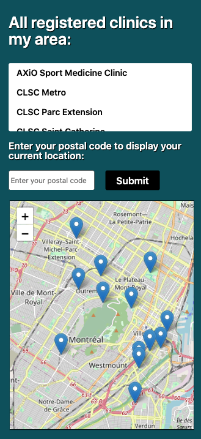
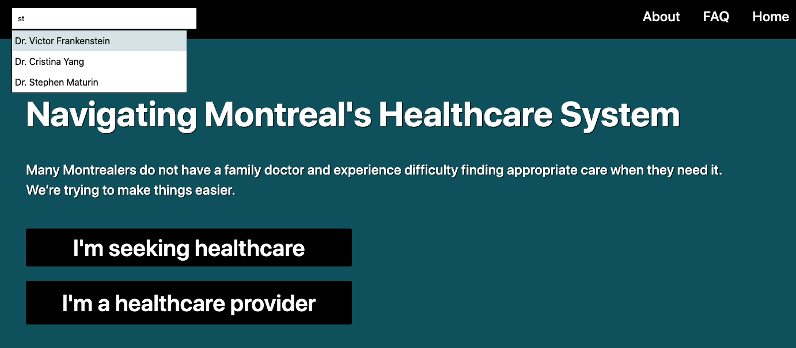
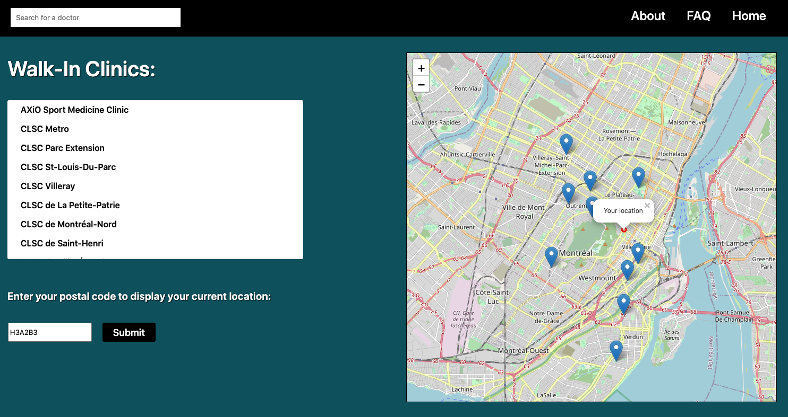
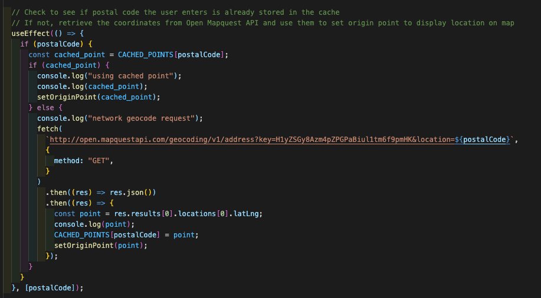

# Final project: Montreal Doctor Finder

# Introduction

This site allows those seeking healthcare in Montreal to access a comprehensive range of information about clinics and doctors in their area with ease and clarity. Inspired by my own challenges finding a family doctor, I wanted to make a site that would allow doctors and clinics to share the most timely, relevant information directly with their patients. The site is fully responsive so it can be used by people on the go using their device of preference.

# Methodology and Languages

The frontend of this site is built with React. Create React App proved to be a useful tool to get things up and running at first. For the backend, I used Node/Express and built my server with RESTful endpoints. Data for the website is stored in MongoDB.

# Patient Use

The site allows individuals to identify clinics based on various criteria: they can see which clinics have doctors that are accepting new patients, whether a clinic allows walk-in appointments, and if advance appointments are allowed without having a GP at that clinic. Users can enter their postal code to see a dynamic display of clinics near them with each of these criteria. Each clinic has a home page displaying its hours, contact info, and the doctors that practice there. Users can also search for specific doctors using the search bar in the top left corner. Since the site is in demo mode, I have populated it with a selection of fictional doctors for the time being.

# Clinic and Doctor Use

Doctors and clinic administrators can register for the site, so they are in full control of the information that is shared with the public. They can easily enter and update the info that is displayed, and while clinic contact info is shown by default (as I feel that this is key information that should always be accessible), doctors have the ability to hide their email and/or phone number to ensure privacy.

# Challenges and Modifications

Initially this site was set up with Google Maps and Google's Geocoding API. After some initial testing it became clear that Google's charges would be prohibitive, so I swapped out OpenStreetMap in place of Google. This was a useful learning experience! Not only did it help to reinforce the importance of being flexible, but it was a good reminder to always have a backup plan. While OpenStreetMap may not have the geographical precision of Google Maps, it is a free and community-driven platform and that aligns nicely with my own ethos and the thinking behind this project.

As a precaution against unnecessary API calls, I set up a caching system for repeat postal code entries. An object called CACHED_POINTS contains a series of postal codes and their respective latitude/longitude coordinates, which I used during testing to ensure the functionality worked properly without making a new API call for each minor change. When a user enters a new postal code, a useEffect is called that compares the entry with all data stored within CACHED_POINTS. If the coordinates already exist in the object, then its stored latitude and longitude are used. If not, a GET request is made to the Open Maps API to retrieve the coordinates. That new data is assigned to originPoint using setState and the coordinates are also added to CACHED_POINTS, where they will remain until the user refreshes their browser. This served as an additional safety measure against redundant API calls.

